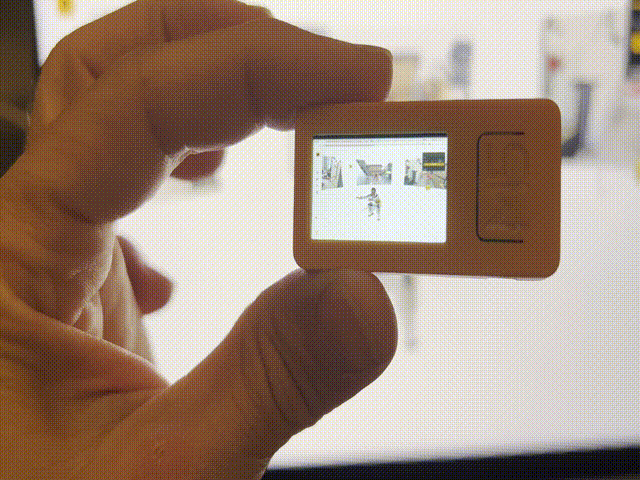
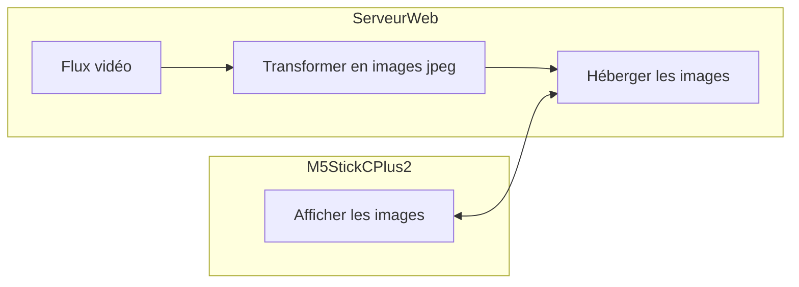

# Video Stream 


- [Video Stream](#video-stream)
  - [Description](#description)
  - [Principe](#principe)
  - [Prérequis](#prérequis)
  - [Docker](#docker)
  - [1. Récuperer ou créer un flux vidéo](#1-récuperer-ou-créer-un-flux-vidéo)
    - [VLC : Streamer son écran, sa webcam ou un fichier vidéo](#vlc--streamer-son-écran-sa-webcam-ou-un-fichier-vidéo)
      - [Streamer son écran](#streamer-son-écran)
      - [Streamer sa webcam](#streamer-sa-webcam)
    - [Flux existant](#flux-existant)
  - [2. Transformer le flux vidéo en images au format jpeg](#2-transformer-le-flux-vidéo-en-images-au-format-jpeg)
  - [3. Héberger les images sur un serveur web](#3-héberger-les-images-sur-un-serveur-web)
  - [Docker compose etape 2 et 3](#docker-compose-etape-2-et-3)
  - [4. Afficher les images sur l'écran](#4-afficher-les-images-sur-lécran)


## Description

L'objectif de ce projet est de récupérer un flux vidéo, de le transformer en images jpeg que nous hebergeons sur un serveur web. Nous affichons ensuite ces images sur l'écran du M5StickCPlus2 qui rafraichit l'image toutes les X secondes.



## Principe



1 - Récupérer ou créer un flux vidéo

2 - Transformer le flux vidéo en images au format jpeg

3 - Héberger les images sur un serveur web

4 - Afficher les images sur l'écran du M5StickCPlus2

Les étapes 1 à 3 sont réalisées sur un serveur ou sur un ordinateur en réseau local avec le M5StickCPlus2.

Pour tester directement sur le M5StickCPlus2 sans réaliser les étapes 1 à 3, vous pouvez utiliser le serveur web suivant : https://stream-cap.arbona.dev/marseille.jpg qui affiche une image de Marseille rafrachit toutes les 5 secondes environ et provenant de la webcam du Vieux Port https://vision-environnement.com/live/player/marseilleport0.php


## Prérequis

Installer les logiciels suivants :
- Docker Compose : https://docs.docker.com/compose/install/
- VLC : https://www.videolan.org/vlc/index.html
- ffmpeg : https://ffmpeg.org/download.html
- Arduino IDE : https://www.arduino.cc/en/software
- M5StickCPlus2 : https://docs.m5stack.com/en/arduino/arduino_ide


## Docker

Docker est un outil qui permet de créer, déployer et exécuter des applications dans des conteneurs. Un conteneur est une unité logicielle légère qui contient tout le nécessaire pour exécuter une application, y compris le code, les bibliothèques, les dépendances, les fichiers de configuration, etc.

Utiliser docker permet d'installer et de configurer facilement les outils nécessaires pour réaliser ce projet (ffmpeg, nginx, serveur rtmp, etc.) sans avoir à installer ces outils directement sur votre ordinateur.

## 1. Récuperer ou créer un flux vidéo

### VLC : Streamer son écran, sa webcam ou un fichier vidéo

vlc est un lecteur multimédia open source qui peut être utilisé pour lire des fichiers audio et vidéo, ainsi que pour diffuser des vidéos en streaming.

Certains commandes bash sont données pour macOS, il est possible de les adapter pour Linux ou Windows.

Les instructions sont données pour le terminal, mais il est possible d'utiliser VLC en mode graphique pour parvenir au même résultat.

#### Streamer son écran

Récuperer la résolution de l'écran :

```bash
system_profiler SPDisplaysDataType | grep Resolution
```

Streamer l'écran :

```bash
vlc screen:// \
    --screen-fps=10 \
    --screen-width=1728 \
    --screen-height=1116 \
    :sout="#transcode{vcodec=mjpg,acodec=none}:http{mux=mpjpeg,dst=:8080/}" \
    :sout-keep \
    --http-host=127.0.0.1
```

La commande ci-dessus permet de streamer l'écran avec une résolution de 1728x1116 pixels à 10 images par seconde. Le flux vidéo est encodé en mjpeg et diffusé sur le port 8080 en utilisant le protocole http.

#### Streamer sa webcam

Récuperer la liste des webcams :

```bash
system_profiler SPCameraDataType | grep "Unique ID"
```

Streamer la webcam :

```bash
vlc avcapture://YOUR-UUID :sout="#transcode{vcodec=h264,acodec=none}:http{mux=ts,dst=:8080/}" :sout-keep --http-host=127.0.0.1
```

La commande ci-dessus permet de streamer la webcam avec l'UUID YOUR-UUID. Le flux vidéo est encodé en h264 et diffusé sur le port 8080 en utilisant le protocole http.

### Flux existant

Exemple de flux existant :

https://streaming.novazion.com/HotelCarre/hotelcarre.stream/chunklist.m3u8

Ce flux est un flux HLS (HTTP Live Streaming) qui peut être lu par VLC.

Pour lire ce flux avec VLC :

```bash
vlc https://streaming.novazion.com/HotelCarre/hotelcarre.stream/chunklist.m3u8
```

## 2. Transformer le flux vidéo en images au format jpeg

ffmpeg est un outil en ligne de commande qui permet de convertir des fichiers audio et vidéo d'un format à un autre. Il peut également être utilisé pour extraire des images d'une vidéo.

Pour extraire des images d'une vidéo, il suffit d'utiliser la commande suivante :

```bash
ffmpeg -y \                     
-nostats \
-loglevel error \
-re \
-i "http://localhost:8080/" \
-vf "scale=240:135,format=yuvj420p" \
-q:v 2 \
-update 1 \
-c:v mjpeg \
site/output.jpg
```

ici, nous avons utilisé les options suivantes :

- -y : écraser le fichier de sortie s'il existe déjà
- -nostats : ne pas afficher les statistiques
- -loglevel error : afficher uniquement les erreurs
- -re : lire l'entrée à la vitesse d'origine
- -i "http://localhost:8080/" : spécifier l'URL du flux vidéo, en l'occurrence http://localhost:8080/ car nous avons streamé l'écran avec VLC sur le port 8080. On peut remplacer cette URL par l'URL du flux vidéo que l'on souhaite traiter, example : https://streaming.novazion.com/HotelCarre/hotelcarre.stream/chunklist.m3u8
- -vf "scale=240:135,format=yuvj420p" : redimensionner l'image à 240x135 pixels et convertir le format de l'image en yuvj420p. C'est la taille de l'écran du M5StickCPlus2.
- -q:v 2 : qualité de l'image jpeg de 2 (entre 2 et 31, 2 étant la meilleure qualité)
- -update 1 : mettre à jour l'image de sortie à chaque nouvelle image extraite
- -c:v mjpeg : encoder l'image en mjpeg
- site/output.jpg : spécifier le nom du fichier de sortie (il faut créer le dossier site avant d'exécuter la commande)

## 3. Héberger les images sur un serveur web

Pour héberger les images sur un serveur web, nous utilisons un serveur web nginx. Nginx est un serveur web open source.

```dockerfile
version: '3'
services:
  web:
    image: nginx
    ports:
      - "80:80"
    volumes:
      - ./site:/usr/share/nginx/html
```

Ce fichier docker-compose.yml permet de lancer un serveur web nginx qui héberge les images dans le dossier site.

Pour lancer le serveur web, il suffit d'exécuter la commande suivante :

```bash
docker-compose up
```

Alternative utiliser python :

```bash
# Create directory
mkdir site
cd site

# Start server on port 8000
python3 -m http.server 8000
```

Les images sont accessibles à l'adresse http://localhost/output.jpg

## Docker compose etape 2 et 3

Grace à docker compose, il est possible de lancer les étapes 2 et 3 en même temps.
Trois fichiers sont nécessaires pour réaliser cette étape : Dockerfile.ffmpeg, capture.sh et docker-compose.yml.

Créer un fichier Dockerfile.ffmpeg :

```dockerfile
FROM ubuntu:latest

RUN apt-get update && apt-get install -y ffmpeg

WORKDIR /app
COPY capture.sh .
RUN chmod +x capture.sh

CMD ["./capture.sh"]
```

Créer un fichier capture.sh :

```bash
#!/bin/bash

OUTDIR="site"
TARGET_WIDTH=240
TARGET_HEIGHT=135
STREAM=${STREAM}
OUTPUT=${OUTPUT}

mkdir -p "$OUTDIR"

# Retry mechanism
while true; do
  ffmpeg -y \
    -nostats \
    -loglevel error \
    -re \
    -i "$STREAM" \
    -vf "scale=$TARGET_WIDTH:$TARGET_HEIGHT,format=yuvj420p" \
    -q:v 1 \
    -update 1 \
    -c:v mjpeg \
    "$OUTDIR/$OUTPUT"

  # If ffmpeg exits, wait before retrying
  echo "ffmpeg exited. Retrying in 10 seconds..."
  sleep 10
done
```

Créer un fichier docker-compose.yml :

```yaml
version: "3"

services:
  nginx-stream-cap:
    image: nginx
    ports:
      - "80:80"
    volumes:
      - ./site:/usr/share/nginx/html
    restart: always

  ffmpeg-vlc:
    build:
      context: .
      dockerfile: Dockerfile.ffmpeg
    volumes:
      - ./site:/app/site
    environment:
      - STREAM=http://host.docker.internal:8080
      - OUTPUT=vlc.jpg
    restart: always

  ffmpeg-hls:
    build:
      context: .
      dockerfile: Dockerfile.ffmpeg
    volumes:
      - ./site:/app/site
    environment:
      - STREAM=https://streaming.novazion.com/HotelCarre/hotelcarre.stream/chunklist.m3u8
      - OUTPUT=marseille.jpg
    restart: always

  ffmpeg-6ter:
    build:
      context: .
      dockerfile: Dockerfile.ffmpeg
    volumes:
      - ./site:/app/site
    environment:
      - STREAM=http://viprtea.top:8080/live/VIP011171731504833260/d63a08a0eee7/430.m3u8
      - OUTPUT=6ter.jpg
    restart: always
```

Pour lancer les services, il suffit d'exécuter la commande suivante :

```bash
docker-compose up
```

Pour arrêter les services, il suffit d'exécuter le raccourci clavier Ctrl+C.

Le docker compose est composé de 4 services :
- nginx-stream-cap : serveur web nginx qui héberge les images
- ffmpeg-vlc : service ffmpeg qui extrait les images du flux vidéo streamé par VLC sur localhost:8080
- ffmpeg-hls : service ffmpeg qui extrait les images du flux vidéo HLS https://streaming.novazion.com/HotelCarre/hotelcarre.stream/chunklist.m3u8
- ffmpeg-6ter : service ffmpeg qui extrait les images du flux vidéo HLS http://viprtea.top:8080/live/VIP011171731504833260/d63a08a0eee7/430.m3u8

Pour que le stick puisse accéder aux images, il faut connecter le stick au même réseau que le serveur web et récupérer l'adresse IP du serveur web.

```bash
ipconfig getifaddr en0 # Pour macOS exemple 192.168.1.5
```

L'adresse IP du serveur web est affichée, il suffit de remplacer localhost par cette adresse IP dans l'URL des images.

```cpp
const char* url = "http://192.168.1.5/vlc.jpg";
```

les URL sont :
- http://ADRESSE_IP/marseille.jpg
- http://ADRESSE_IP/6ter.jpg
- http://ADRESSE_IP/vlc.jpg


## 4. Afficher les images sur l'écran

Pour afficher les images sur l'écran, nous utilisons la librairie M5Unified. 

https://docs.m5stack.com/en/arduino/m5gfx/m5gfx_functions

La fonction drawJpgUrl permet d'afficher une image jpeg à partir d'une URL. 

```cpp
void drawJpgUrl(const String &url, int32_t x = 0, y = 0, maxWidth = 0, maxHeight = 0, int32_t offX = 0, int32_t offY = 0, float scale_x = 1.0f, float scale_y = 1.0f, datum_t datum = datum_t::top_left )
```

Le code suivant permet d'afficher une image jpeg à partir d'une URL. Les paramètres autres que l'URL sont optionnels et permettent de définir la position de l'image, sa taille, etc.

```cpp
StickCP2.Display.drawJpgUrl(URL);
```

Il reste à se connecter au réseau wifi et à rafraichir l'image toutes les X secondes. 

Le code présenté ici https://docs.m5stack.com/en/arduino/m5stickc_plus2/rtc montre notamment comment se connecter à un réseau wifi. 

```cpp
WiFi.begin(WIFI_SSID, WIFI_PASSWORD);
while (WiFi.status() != WL_CONNECTED) {
    Serial.print('.');
    delay(500);
}
```

Premiere version du code, simple, sans gestion des erreurs, ni indication de l'état de la connexion wifi :

```cpp
#define WIFI_SSID "YOUR_SSID" // Nom du réseau wifi
#define WIFI_PASSWORD "YOUR_PASSWORD" // Mot de passe du réseau wifi

#include <HTTPClient.h> // Necessaire pour utiliser la fonction drawJpgUrl
#include <M5StickCPlus2.h>

const char* url = "https://stream-cap.arbona.dev/marseille.jpg"; // URL de l'image à afficher

void setup() {
  // Initialisation du M5StickCPlus2
  auto cfg = M5.config();
  StickCP2.begin(cfg);

  // Connexion au réseau wifi
  WiFi.begin(WIFI_SSID, WIFI_PASSWORD);

  // Tant que la connexion n'est pas établie, on attend
  while (WiFi.status() != WL_CONNECTED) {
    delay(500);
  }
  
  // L'image est affichée en mode paysage, on tourne l'écran
  StickCP2.Display.setRotation(1); 

}


void loop(void) {
    // On affiche l'image
    StickCP2.Display.drawJpgUrl(url);

    // On attend 1 seconde avant de rafraichir l'image une nouvelle fois
    delay(1000);
}


```


Code complet :

```cpp
#define WIFI_SSID "YOUR_SSID"
#define WIFI_PASSWORD "YOUR_PASSWORD"

#include <HTTPClient.h>
#include <M5StickCPlus2.h>

HTTPClient http;

const char* url = "https://stream-cap.arbona.dev/marseille.jpg";
unsigned long lastUpdate = 0;
const unsigned long UPDATE_INTERVAL = 1000;
int failureCount = 0;
const int MAX_FAILURES = 3;

void setup() {
  auto cfg = M5.config();
  StickCP2.begin(cfg);
  Serial.begin(9600);
  StickCP2.Display.setRotation(1);

  connectWifi();
}


void loop(void) {
  unsigned long currentMillis = millis();

  if (currentMillis - lastUpdate >= UPDATE_INTERVAL) {


    lastUpdate = currentMillis;

    http.begin(url);
    int httpCode = http.GET();

    if (httpCode == HTTP_CODE_OK) {
      int len = http.getSize();
      if (len > 100) {  // Minimum size for valid JPEG
        bool success = StickCP2.Display.drawJpgUrl(url);
        if (!success) {
          Serial.println("Failed to draw image");
        }
      } else {
        Serial.println("Empty response received");
        delay(100);  // Wait before retry
      }
    } else {
      Serial.printf("HTTP GET failed with error: %d\n", httpCode);
      delay(100);
    }

    http.end();
  }
}


void connectWifi() {
  StickCP2.Display.print("Connecting to ");
  StickCP2.Display.print(WIFI_SSID);

  WiFi.begin(WIFI_SSID, WIFI_PASSWORD);

  while (WiFi.status() != WL_CONNECTED) {

    StickCP2.Display.print(".");

    delay(500);
  }

  StickCP2.Display.print(" Connected!");
}
```

Dans ce code, nous avons ajouté une fonction connectWifi qui permet de se connecter au réseau wifi.

L'utilisation de Serial permet de débugger le programme en affichant des messages sur le moniteur série. De même, l'utilisation de la fonction print() de M5Unified permet d'afficher des messages sur l'écran du M5StickCPlus2.

L'utilisation du client HTTP permet de s'assurer que l'image est bien récupérée avant de l'afficher.

Nous avons également ajouté un compteur de tentatives de connexion au réseau wifi. Si la connexion échoue 3 fois, le programme s'arrête.

L'utilisation de millis() permet de rafraichir l'image toutes les secondes sans bloquer le programme avec delay().