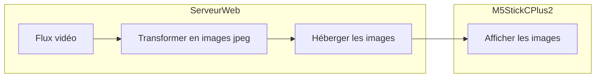

# Video Stream 


- [Video Stream](#video-stream)
  - [Description](#description)
  - [1. Récuperer ou créer un flux vidéo](#1-récuperer-ou-créer-un-flux-vidéo)
    - [VLC : Streamer son écran, sa webcam ou un fichier vidéo](#vlc--streamer-son-écran-sa-webcam-ou-un-fichier-vidéo)
  - [2. Transformer le flux vidéo en images au format jpeg](#2-transformer-le-flux-vidéo-en-images-au-format-jpeg)
  - [3. Héberger les images sur un serveur web](#3-héberger-les-images-sur-un-serveur-web)
  - [4. Afficher les images sur l'écran](#4-afficher-les-images-sur-lécran)


## Description

L'objectif de ce projet est de récupérer un flux vidéo, de le transformer en images jpeg que nous hebergeons sur un serveur web. Nous affichons ensuite ces images sur l'écran du M5StickCPlus2 qui rafraichit l'image toutes les X secondes.


1 - Récupérer ou créer un flux vidéo

2 - Transformer le flux vidéo en images au format jpeg

3 - Héberger les images sur un serveur web

4 - Afficher les images sur l'écran du M5StickCPlus2

Les étapes 1 à 3 sont réalisées sur un serveur web ou sur un ordinateur en réseau local avec le M5StickCPlus2.

Pour tester directement sur le M5StickCPlus2 sans réaliser les étapes 1 à 3, vous pouvez utiliser le serveur web suivant : https://stream-cap.arbona.dev/marseille.jpg qui affiche une image de Marseille rafrachit toutes les 5 secondes environ et provenant de la webcam du Vieux Port https://vision-environnement.com/live/player/marseilleport0.php



Les points 1 à 3 sont réalisés sur un serveur web ou un ordinateur en réseau local. Ils peuvent etre géré avec docker-compose. 

```yaml
```

## 1. Récuperer ou créer un flux vidéo

### VLC : Streamer son écran, sa webcam ou un fichier vidéo

## 2. Transformer le flux vidéo en images au format jpeg

## 3. Héberger les images sur un serveur web

## 4. Afficher les images sur l'écran

Pour afficher les images sur l'écran, nous utilisons la librairie M5Unified. 

https://docs.m5stack.com/en/arduino/m5gfx/m5gfx_functions

La fonction drawJpgUrl permet d'afficher une image jpeg à partir d'une URL. 

```cpp
void drawJpgUrl(const String &url, int32_t x = 0, y = 0, maxWidth = 0, maxHeight = 0, int32_t offX = 0, int32_t offY = 0, float scale_x = 1.0f, float scale_y = 1.0f, datum_t datum = datum_t::top_left )
```

Le code suivant permet d'afficher une image jpeg à partir d'une URL. Les paramètres autres que l'URL sont optionnels et permettent de définir la position de l'image, sa taille, etc.

```cpp
StickCP2.Display.drawJpgUrl(URL);
```

Il reste à se connecter au réseau wifi et à rafraichir l'image toutes les X secondes. 

Le code présenté ici https://docs.m5stack.com/en/arduino/m5stickc_plus2/rtc montre notamment comment se connecter à un réseau wifi. 

```cpp
WiFi.begin(WIFI_SSID, WIFI_PASSWORD);
while (WiFi.status() != WL_CONNECTED) {
    Serial.print('.');
    delay(500);
}
```

Premiere version du code, simple, sans gestion des erreurs, ni indication de l'état de la connexion wifi :

```cpp
#define WIFI_SSID "YOUR_SSID" // Nom du réseau wifi
#define WIFI_PASSWORD "YOUR_PASSWORD" // Mot de passe du réseau wifi

#include <HTTPClient.h> // Necessaire pour utiliser la fonction drawJpgUrl
#include <M5StickCPlus2.h>

const char* url = "https://stream-cap.arbona.dev/marseille.jpg"; // URL de l'image à afficher

void setup() {
  // Initialisation du M5StickCPlus2
  auto cfg = M5.config();
  StickCP2.begin(cfg);

  // Connexion au réseau wifi
  WiFi.begin(WIFI_SSID, WIFI_PASSWORD);

  // Tant que la connexion n'est pas établie, on attend
  while (WiFi.status() != WL_CONNECTED) {
    delay(500);
  }
  
  // L'image est affichée en mode paysage, on tourne l'écran
  StickCP2.Display.setRotation(1); 

}


void loop(void) {
    // On affiche l'image
    StickCP2.Display.drawJpgUrl(url);

    // On attend 1 seconde avant de rafraichir l'image une nouvelle fois
    delay(1000);
}


```


Code complet :

```cpp
#define WIFI_SSID "YOUR_SSID"
#define WIFI_PASSWORD "YOUR_PASSWORD"

#include <HTTPClient.h>
#include <M5StickCPlus2.h>

HTTPClient http;

const char* url = "https://stream-cap.arbona.dev/marseille.jpg";
unsigned long lastUpdate = 0;
const unsigned long UPDATE_INTERVAL = 1000;
int failureCount = 0;
const int MAX_FAILURES = 3;

void setup() {
  auto cfg = M5.config();
  StickCP2.begin(cfg);
  Serial.begin(9600);
  StickCP2.Display.setRotation(1);

  connectWifi();
}


void loop(void) {
  unsigned long currentMillis = millis();

  if (currentMillis - lastUpdate >= UPDATE_INTERVAL) {


    lastUpdate = currentMillis;

    http.begin(url);
    int httpCode = http.GET();

    if (httpCode == HTTP_CODE_OK) {
      int len = http.getSize();
      if (len > 100) {  // Minimum size for valid JPEG
        bool success = StickCP2.Display.drawJpgUrl(url);
        if (!success) {
          Serial.println("Failed to draw image");
        }
      } else {
        Serial.println("Empty response received");
        delay(100);  // Wait before retry
      }
    } else {
      Serial.printf("HTTP GET failed with error: %d\n", httpCode);
      delay(100);
    }

    http.end();
  }
}


void connectWifi() {
  StickCP2.Display.print("Connecting to ");
  StickCP2.Display.print(WIFI_SSID);

  WiFi.begin(WIFI_SSID, WIFI_PASSWORD);

  while (WiFi.status() != WL_CONNECTED) {

    StickCP2.Display.print(".");

    delay(500);
  }

  StickCP2.Display.print(" Connected!");
}
```

Dans ce code, nous avons ajouté une fonction connectWifi qui permet de se connecter au réseau wifi.

L'utilisation de Serial permet de débugger le programme en affichant des messages sur le moniteur série. De même, l'utilisation de la fonction print() de M5Unified permet d'afficher des messages sur l'écran du M5StickCPlus2.

L'utilisation du client HTTP permet de s'assurer que l'image est bien récupérée avant de l'afficher.

Nous avons également ajouté un compteur de tentatives de connexion au réseau wifi. Si la connexion échoue 3 fois, le programme s'arrête.

L'utilisation de millis() permet de rafraichir l'image toutes les secondes sans bloquer le programme avec delay().